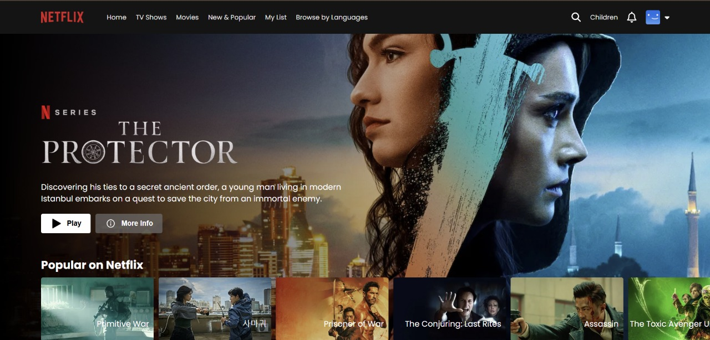

# 🎬 CineApp – Clon Creativo de Netflix



> “Luces, cámara… ¡acción! 🎥 Bienvenido a **CineApp**, un homenaje visual y funcional al universo del streaming.”

---

## 🚫 Importante

⚠️ **Este proyecto no puede abrirse directamente desde el navegador público.**
Google puede interpretarlo erróneamente como un intento de _phishing_ debido a su gran parecido visual con Netflix.

👉 En su lugar, clónalo y ejecútalo localmente para disfrutarlo sin restricciones:

```bash
git clone https://github.com/metazack89/cineapp.git
cd cineapp
npm install
npm run dev
```

Cuando esté listo para producción:

```bash
npm run build
firebase deploy
```

El proyecto se despliega automáticamente a Firebase Hosting a través de GitHub Actions 💫

---

## 🧠 ¿Qué es CineApp?

**CineApp** es una réplica moderna y experimental del entorno de Netflix, creada con fines educativos y de práctica de desarrollo frontend y backend ligero.
Su objetivo es recrear la experiencia visual, las animaciones y la estructura de navegación de una plataforma de streaming real.

---

## 🛠️ Tecnologías que dan vida a CineApp

✨ **Frontend futurista**

- ⚛️ **React 19** – Componentes declarativos, ganchos y rendimiento puro.
- 🧭 **React Router DOM 7** – Navegación fluida entre secciones y páginas dinámicas.
- 🎉 **React Toastify** – Notificaciones elegantes para mejorar la interacción del usuario.
- ⚡ **Vite 7** – Compilación ultrarrápida con recarga instantánea.

🔥 **Backend ligero con superpoderes**

- ☁️ **Firebase 12** – Autenticación, hosting y base de datos en tiempo real.
- 🚀 **react-firebase-hooks** – Integración directa con los servicios de Firebase.

🧹 **Código limpio y elegante**

- 🧩 **ESLint + Plugins de React** – Mantiene un estilo de código uniforme y profesional.
- 🌍 **Globals & Type Definitions** – Facilita el desarrollo tipado y predecible.

---

## ⚙️ Configuración rápida

1. Crea un proyecto en [Firebase Console](https://console.firebase.google.com)
2. Configura tus credenciales en `.env`
3. Ejecuta:

   ```bash
   npm run build
   firebase deploy
   ```

4. ¡Listo! Tu CineApp estará disponible en el hosting configurado ✨

---

## 💡 Nota final

CineApp **no tiene fines comerciales**.
Es un proyecto educativo que explora cómo combinar **Firebase + React + Vite** para crear experiencias web ricas y modernas.

🎬 _El show debe continuar… ¡pero el código también!_
